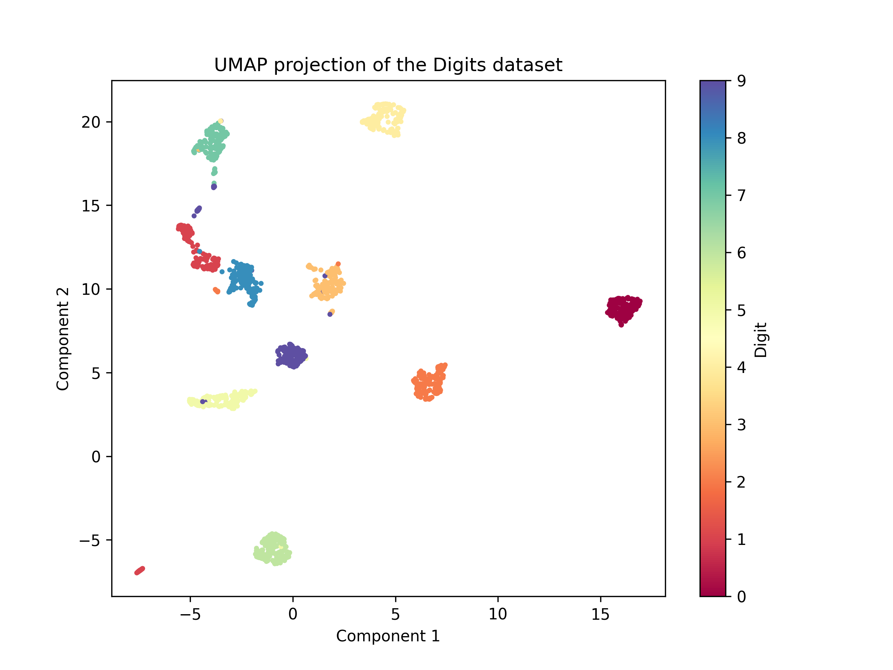

# 🪻📈 Iris KNN Model 🪻📈

This project implements a simple K-Nearest Neighbors (KNN) model on the Iris dataset. The model is trained to classify Iris species based on their features and can be used to make predictions on new iris data. 

## Features

🪻 Creates and trains a KNN model to predict Iris species via their features. 

🪻 Saves the trained model for future use. 

🪻 Ensures validation through a output verification. 

### Prerequisites

This project requires Python 3.6+ and the following Python packages:

- `scikit-learn`
- `pickle`
- `json`

## Installation 

1️⃣ **Clone the repository**:
   ```bash
   git clone git@github.com:DSAN6700-24Fall/assignment-1-jaehobahng.git
   ```

2️⃣ **Navigate to the project directory**:
   ```bash
   cd assignment-1-jaehobahng-problem4
   ```

3️⃣ **Ensure Python is installed**:
   Make sure you have Python 3.6+ installed. You can check by running:
   ```bash
   python --version
   ```

## Usage

🪻 To create and train a model for the Iris dataset, simply run the following bash command. 

```bash
 python -m iris
```

OR, when inside the `iris` directory, run:

```bash
 python main.py
```
🪻 This is will produce the `out.json` file of the model's predictions as well as `model.pkl`.
    Following these results, you can run the `train_test.py` file as follows from the `tests` directory to verify the training of the model. 

```bash
 python train_test.py
```
🪻 Lastly, to create a UMAP visualization of the digits data (this can be altered to reflect the output data for the iris model) run the following from the root directory. 

```bash
 python visualize.py
```

🪻 Your output should look something like this:

<!--  -->


## Code Review

The project is composed of the following files:

📈 `inference.py`: The main script loads the model and data and saves the output predictions.

📈 `train.py`: Defines the `Model` class, which defines the KNN model, training procedure, and evaluation metrics.

📈 `train_test.py`: This script can be used to verify the accuracy of the trained model on the data provided. 

📈 `iris_data.json`: Input data file containing Iris records to make predictions on.

📈 `model.pkl`: The saved KNN model after training.

📈 `out.json`: Output file containing the predictions for the given input data.

📈 `visualize.py`: Creates a UMAP visualization of the provided digits data. 

## Error Handling
Currently, the script checks whether data was provided for the training process or not and stops the program if there is no data. For the future, additional errors can be raised to handle poorly structured data. 
